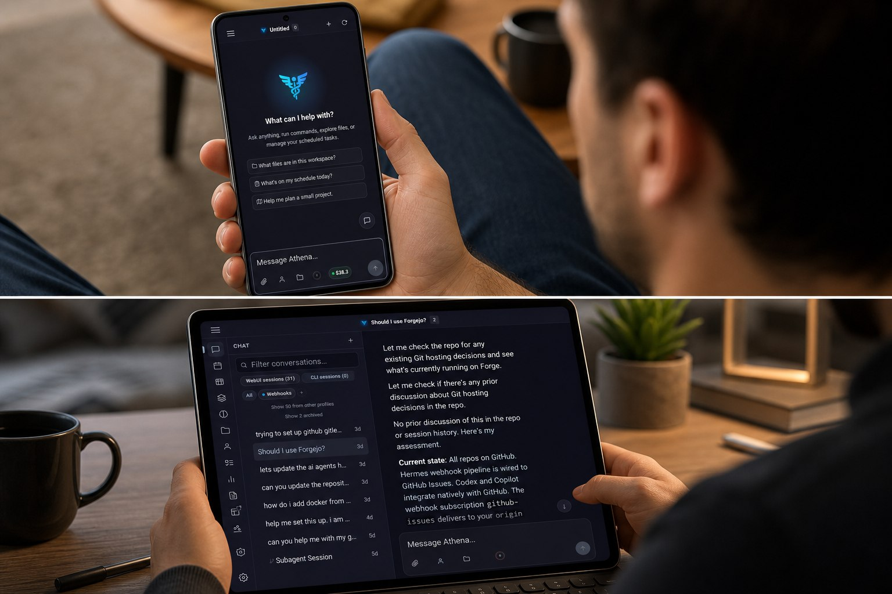
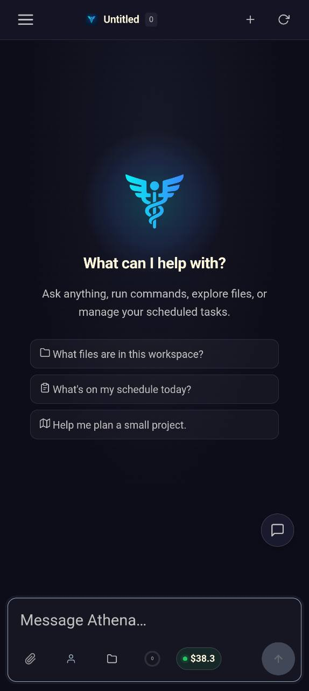
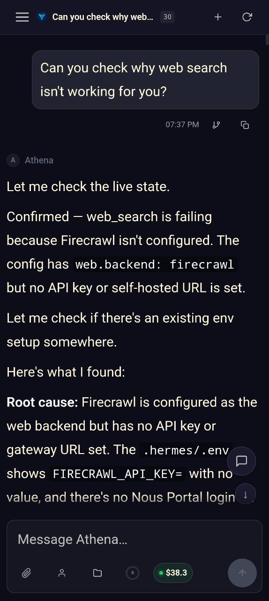
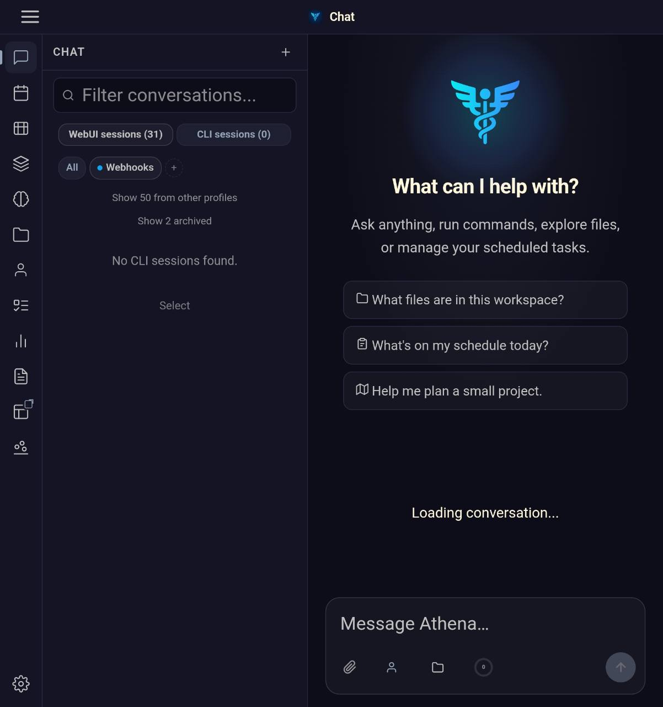
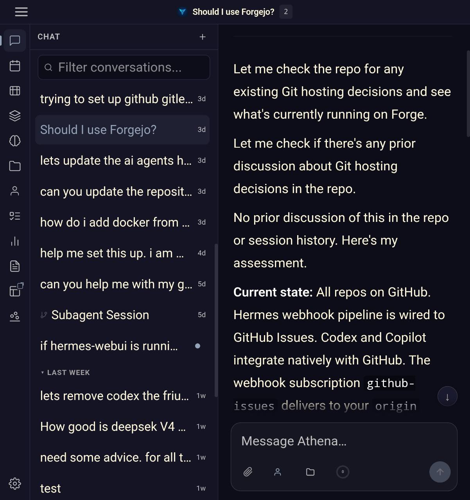

# Hermes-Android

Hermes-Android brings the Hermes WebUI experience to Android without turning it
into a second product.

It keeps Hermes WebUI as the real application surface and adds the Android
capabilities that matter on a phone or tablet: a hardened WebView, trusted
navigation, native sharing, uploads and downloads, notifications, secure local
settings, update delivery, and recovery paths when the mobile runtime gets in
the way.

If Hermes WebUI is the product, Hermes-Android is the native shell that makes
it feel at home on Android.

- Your Hermes workspace, on Android
- Native where Android matters
- WebUI where Hermes matters



## See It

Hermes-Android keeps the real Hermes experience intact, then makes it feel
right on Android.

<table>
  <tr>
    <td width="50%">
      
    </td>
    <td width="50%">
      
    </td>
  </tr>
  <tr>
    <td width="50%">
      
    </td>
    <td width="50%">
      
    </td>
  </tr>
</table>

Requires a running
[Hermes WebUI](https://github.com/nesquena/hermes-webui) instance. On first
launch, enter the URL for your Hermes server.

## Why This Exists

Hermes already has a strong web experience. Android should not fork that
experience or reimplement it badly.

This repository exists to solve the Android-specific problems well:

- Host Hermes WebUI inside a secure, reliable Android shell
- Preserve WebUI behavior instead of replacing it with app-specific workflows
- Fix Android WebView compatibility issues that break real usage
- Add Android-native capabilities where the browser alone is not enough
- Keep distribution, signing, updates, and device behavior production-ready

The result is a native-feeling Android client that still behaves like Hermes
WebUI, not a parallel mobile rewrite that drifts out of sync.

## Who This Is For

Hermes-Android is built for:

- Hermes users who want their real workspace on Android, not a reduced mobile fallback
- Self-hosters who need HTTP or HTTPS support for trusted local or remote Hermes deployments
- Testers and contributors who want a proper Android distribution channel instead of a one-off wrapper
- Teams that want Hermes WebUI parity while still respecting Android platform expectations

## Why Not Just Use Chrome?

Because opening Hermes in a mobile browser is not the same as integrating it
properly with Android.

Hermes-Android adds the platform work that a plain browser tab does not own:

- Trusted in-app navigation and host-boundary enforcement
- Native share-sheet intake, uploads, downloads, and camera capture
- Android-backed notifications and update delivery
- Recovery flows for bad server settings, broken WebView states, and reconnect windows
- WebView-specific compatibility fixes so Hermes surfaces render and behave correctly on Android

The goal is not to replace the web app. The goal is to make the web app feel
first-class on Android.

## What Hermes-Android Owns

- Secure WebView hosting for trusted Hermes HTTP and HTTPS deployments
- Host allowlist enforcement and external handoff for untrusted links
- Android lifecycle, recovery, deep links, and session restore behavior
- Native settings, encrypted local storage, and server profile management
- Share-sheet intake, file uploads, downloads, and camera capture
- Android-backed Hermes notifications and update alerts
- Release packaging for both Play and GitHub channels

## What Stays In Hermes WebUI

- Product behavior and feature workflows
- Chat, sessions, workspace, routing, and API behavior
- UI layout, styling, animations, and dashboard behavior
- Cross-platform features that should work the same in browser, desktop, and Android

If a change belongs to Hermes everywhere, it belongs in WebUI first.

## Highlights

### Native Hermes, not a compromised wrapper

- Kotlin + Jetpack Compose app shell around Hermes WebUI
- Hardened WebView defaults with DOM storage and browser-managed HTTP and service-worker cache behavior
- Pull-to-refresh, loading, offline, and recovery flows designed for Android
- Deep link support for Hermes sessions through `hermes://session/{id}`
- Native recovery route through `hermes://app/settings`

### Android-specific compatibility work that matters

- Measured viewport-height repair for Android WebView builds that collapse Hermes layout and floating surfaces when CSS viewport units resolve incorrectly
- System-bar safe inset handling so Hermes content does not sit under Android status and navigation bars
- Forced WebView darkening disabled so Hermes controls its own visual presentation
- Local network permission handling for Android 16+ so LAN-hosted Hermes WebUI instances can load inside the WebView
- Microphone compatibility handling so trusted Hermes pages can use Android-supported capture paths
- OAuth/OIDC callback handling that keeps trusted sign-in flows in-app until the declared Hermes callback returns

### Real Android integration

- File uploads and downloads, including direct camera capture when pages request image capture
- Share-to-app intake for text and files
- Android-backed browser notifications for Hermes WebUI alerts
- Optional ongoing background activity notification for trusted Hermes sessions
- Optional debug-log capture with persistent foreground notification and one-tap stop action

### Security and trust boundaries

- Only `http://` and `https://` Hermes hosts are supported in-app
- Allowlisted Hermes navigation stays in-app; other web links are externalized
- Non-web schemes are blocked
- Notification routing, microphone access, and callback handling stay scoped to trusted Hermes origins
- Local settings are encrypted with Android Keystore-backed storage

## What It Feels Like

When Hermes-Android is doing its job well, the experience should be simple:

- Open the app and land in your actual Hermes environment
- Stay inside Hermes for trusted work instead of bouncing between browser surfaces
- Use Android-native sharing, capture, notifications, and recovery where the phone should help
- Keep Hermes WebUI as the source of truth for product behavior and interface flow

## Availability

Hermes-Android currently publishes through two release channels:

- Google Play internal testing via the official `release` build
- GitHub APK distribution via the side-by-side `github` build

Current checked-in release metadata:

- Version name: `0.1.24`
- Version code: `124`
- Play application ID: `com.hermeswebui.android`
- GitHub application ID: `com.hermeswebui.android.github`
- Compile SDK / target SDK: `37`

If you want access to the Play internal test track, message
[@Paladin173](https://github.com/Paladin173) with the Gmail address that should
be added as a tester.

## Quick Start

```powershell
git clone https://github.com/hermes-webui/hermes-android.git
cd hermes-android
.\gradlew.bat assembleDebug --no-daemon
```

Open the repository in Android Studio to run on an emulator or device.

Requirements:

- Android Studio with Android SDK 37
- JDK 17 or newer compatible with Gradle
- A reachable Hermes WebUI URL over HTTP or HTTPS

## Configuration

Default app strings live in:

- `app/src/main/res/values/strings.xml`

Important values:

- `default_server_url` - default Hermes WebUI URL
- `default_dashboard_url` - optional explicitly configured dashboard origin used only for Android-side Custom Tab matching
- `app_name` - Android launcher label

Android identity and app-level wiring live in:

- `app/build.gradle.kts`
- `app/src/main/AndroidManifest.xml`
- `settings.gradle.kts`

The shipped WebUI default is a placeholder HTTPS origin and the shipped
dashboard default is blank. In normal use, WebUI owns dashboard auto-detect and
persistence.

## Build, Signing, and Release

Local signed release builds use an untracked repo-root `keystore.properties`
file. CI builds use the corresponding `ANDROID_KEYSTORE_*` environment
variables and secrets.

Local signing setup:

1. Copy `keystore.properties.example` to `keystore.properties`.
2. Fill in the real keystore path and passwords.
3. Keep that file untracked.

Example:

```properties
storeFile=C:/path/to/upload-keystore.jks
storePassword=replace-me
keyAlias=upload
keyPassword=replace-me
```

Useful commands:

```powershell
.\gradlew.bat test --no-daemon
.\gradlew.bat assembleDebug --no-daemon
.\gradlew.bat stageGithubReleaseApk --no-daemon
.\gradlew.bat printReleaseVersionName --no-daemon
```

Optional checks:

```powershell
.\gradlew.bat lint --no-daemon
.\gradlew.bat connectedDebugAndroidTest --no-daemon
```

Release automation is centered on:

- `.github/workflows/1-orchestration-release.yml`
- `.github/workflows/2-publish-github-apk.yml`
- `.github/workflows/3-publish-play-store-release.yml`

That flow builds:

- `hermes-webui-v<version>-github.apk` for GitHub/device installs
- `hermes-webui-v<version>.aab` for Google Play internal testing

Manual orchestration runs auto-bump `appVersionName` from the latest published
`vX.Y.Z` tag, sync the checked-in README release metadata, commit the bump back
to `main`, and build from that version-bump commit. `versionCode` is derived
from semantic version as `major*10000 + minor*100 + patch`.

See [RELEASE.md](./RELEASE.md) for the operator workflow.

## Architecture

Core runtime areas:

- `MainActivity.kt` - Android platform boundary, WebView host, intents, dashboard Custom Tab handoff
- `core/security/` - URL policy and trust-boundary decisions
- `data/` - encrypted settings persistence and local state
- `domain/` - validation and share-intent parsing
- `notification/` - Hermes notification bridge and Android notification presentation
- `background/` - reconnect, debug logging, and foreground-service coordination
- `server/` - startup preflight and server profile validation/switching
- `update/` - Play and GitHub update checks and update UX
- `ui/` - Compose screens and ViewModel state

See [ARCHITECTURE.md](./ARCHITECTURE.md) for the detailed runtime flow and
security model.

## Documentation

- [ROADMAP.md](./ROADMAP.md) - project status, maintenance posture, and wishlist
- [ARCHITECTURE.md](./ARCHITECTURE.md) - runtime flow, boundaries, and extension points
- [RELEASE.md](./RELEASE.md) - release operator workflow and retry path
- [AGENTS.md](./AGENTS.md) - repository instructions for AI assistants
- [projects/](./projects/) - active project notes and implementation plans
- [assets/](./assets/) - README images, branding assets, icons, and TWA handoff files
